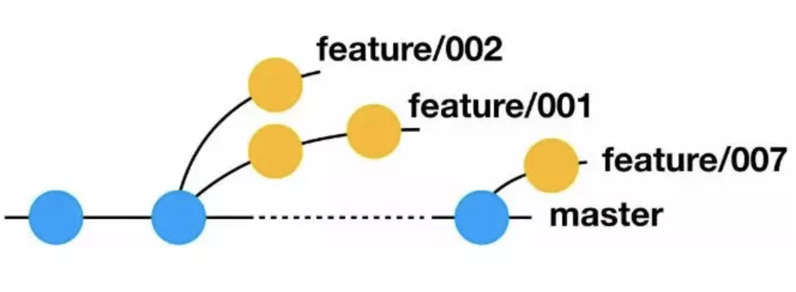
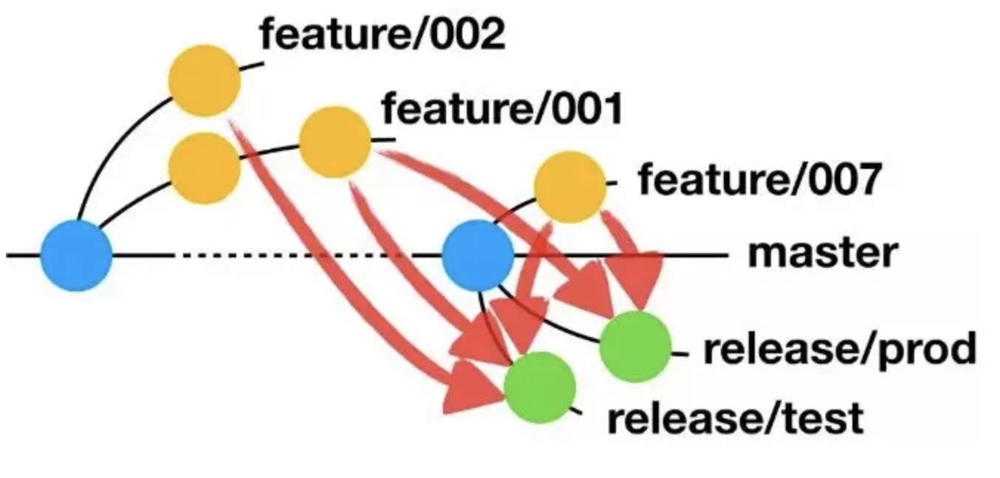
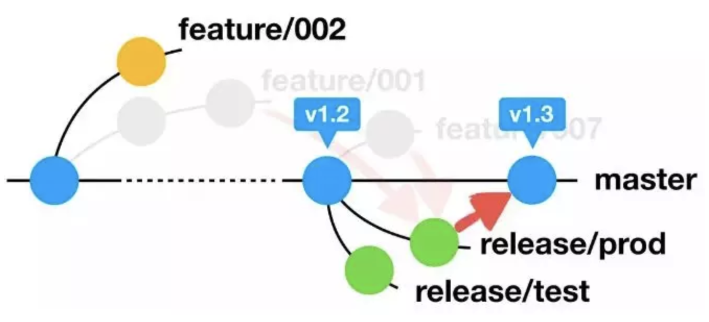

# Git

Git是目前世界上最先进的分布式版本控制系统。

**参考资料**：https://www.liaoxuefeng.com/wiki/0013739516305929606dd18361248578c67b8067c8c017b000/001373962845513aefd77a99f4145f0a2c7a7ca057e7570000

常用命令：

```
# 0 初始化一个git仓库
git init
# 从远程仓库克隆
git clone <repository>

# 提交新文件和提交修改
# 1 添加文件到仓库（工作区 -> 暂存区）
git add <file or dir list>

# 2 把文件提交到仓库（暂存区 -> 版本库）
git commit -m <message>

# 3 推送到远程仓库
git push
```

```
# 查看状态
git status

# 查看具体修改内容
git diff <file>
git diff HEAD -- <file>

# 查看版本日志
git log --graph --pretty=oneline

```

```
# 回退到指定版本
# commitid: HEAD当前版本 HEAD^上一版本 HEAD^^上两个版本 HEAD～100 前100个版本
git reset --hard <commitid>

# 查看git命令记录
git reflog

# 撤销工作区更改
git checkout -- <file>

# 撤销暂存区更改（更改内容回退到工作区）
git reset HEAD <file>

```

```
# 用版本库里的版本替换工作区版本
git checkout -- <file>

# 切换分支
git checkout -b <branchname>

# 查看分支
git branch

# 合并分支
git merge <branchname>

# 删除分支
git branch -d <branchname>

```

```
# 设置别名
git config --global alias.co checkout
git config --global alias.ci commit
git config --global alias.br branch
git config --global alias.unstage 'reset HEAD'
git config --global alias.last 'log -1'
git config --global alias.lg "log --color --graph --pretty=format:'%Cred%h%Creset -%C(yellow)%d%Creset %s %Cgreen(%cr) %C(bold blue)<%an>%Creset' --abbrev-commit"
```

### Git 分支模式

1. TrunkBased

由单个主干分支和许多发布分支组成，每个发布分支在特定版本的提交点上从主干创建出来，用来进行上线部署和 Hotfix，没有显性的特性分支。

TrunkBased 模式有两种常见演进版本。OneFlow 模式参考了 TrunkBased 的许多思想，对操作流程做了更严格的定义，增加了 Hotfix 分支等内容。多主干模式（通常是双主干，固定的开发分支和固定的发布分支），算是 TrunkBased 采用固定发布分支的特例。

2. GitFlow

包含一个主干分支、一个开发分支、许多的特性分支、许多的发布分支和 Hotfix 分支，以及许多繁琐的合并规则。

3. GithubFlow

在 TrunkBased 的基础上，增加了个人仓库和 Pull Request 合并代码的操作，与在同一个仓库里增加个人分支的做法类似，从实用的意义来说，它更合适分布式团队。

GithubFlow 也有演进版本，例如强调了多环境部署和将仓库或分支与环境关联的 GitlabFlow 模式。

4. **AoneFlow**

在 AoneFlow 上你能看到许多其他分支模式的影子。它基本上兼顾了 TrunkBased 的“易于持续集成”和 GitFlow 的“易于管理需求”特点，同时规避掉 GitFlow 的那些繁文缛节。

看一下具体套路。AoneFlow 只使用三种分支类型：主干分支、特性分支、发布分支，以及三条基本规则。

**规则一，开始工作前，从主干创建特性分支。**

AoneFlow 的特性分支基本借鉴 GitFlow，没有什么特别之处。每当开始一件新的工作项（比如新的功能或是待解决的问题）的时候，从代表最新已发布版本的主干上创建一个通常以`feature/`前缀命名的特性分支，然后在这个分支上提交代码修改。也就是说，每个工作项（可以是一个人完成，或是多个人协作完成）对应一个特性分支，所有的修改都不允许直接提交到主干。



**规则二，通过合并特性分支，形成发布分支。**

AoneFlow 的发布分支设计十分巧妙，可谓整个体系的精髓。GitFlow 先将已经完成的特性分支合并回公共主线（即开发分支），然后从公共主线拉出发布分支。TrunkBased 同样是等所有需要的特性都在主干分支上开发完成，然后从主干分支的特定位置拉出发布分支。而 AoneFlow 的思路是，从主干上拉出一条新分支，将所有本次要集成或发布的特性分支依次合并过去，从而得到发布分支。发布分支通常以`release/`前缀命名。



**规则三，发布到线上正式环境后，合并相应的发布分支到主干，在主干添加标签，同时删除该发布分支关联的特性分支。**

当一条发布分支上的流水线完成了一次线上正式环境的部署，就意味着相应的功能真正地发布了，此时应该将这条发布分支合并到主干。为了避免在代码仓库里堆积大量历史上的特性分支，还应该清理掉已经上线部分特性分支。与 GitFlow 相似，主干分支上的最新版本始终与线上版本一致，如果要回溯历史版本，只需在主干分支上找到相应的版本标签即可。




**参考资料**：http://mp.weixin.qq.com/s/JsBX3UPgZL_HUOTCIopr_A
